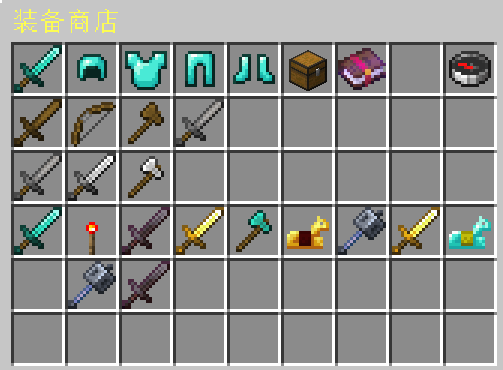

# 🚀 超能激战玩家教程

《超能激战》旨在提供一种快节奏、低门槛但具有深度的团队竞技体验。它结合了《英雄联盟》和《守望先锋》游戏的局内成长乐趣和英雄射击/动作游戏的即时战斗快感。玩家无需漫长的对线期，直接投入激烈的据点争夺和团战中，通过操作和策略带领团队走向胜利。

## 🎯 游戏类型

团队PVP/职业乱斗/占点竞技 

## ⛳️ 核心玩法

#### 1）占点竞技玩法

地图设有关键据点区域。玩家站在区域内时，据点进度条会向己方偏移。
若区域内有两种队伍玩家，则停止计算。占点速度随着游戏时间增长而变快

>* 局内经济： 完整的“杀敌 -> 买装备 -> 变强”循环。
>* 成就系统：计入个人生涯战绩、胜率和段位积分。
>* 策略深度：包含复活倒计时、野怪/BOSS 资源争夺。
>* 多样化：多种定位职业角色供选择。

#### 2）训练场

提供木桩或无敌状态目标用于**伤害测试**、**技能测试**。 
**注：训练场数据不会保存，退服即清理。*

## 3. 角色技能

**触发方式**：数字键 `1-4` （切换物品栏）  
**角色定位**：前排、后排、辅助

### 前排类
> 定位：抗伤、保护、切入、收割。 
> 角色：铁傀儡、泰坦、雷神之锤、战锤圣徒、苦力怕、凋零王、坚守者、雷神、狂战士。

### 后排类
> 定位：持续输出、远程压制。 
> 角色：烈焰人、美杜莎、神枪手、士兵、水神、唤魔者、恶魂、影刃、旋风人。

### 辅助类
> 定位：团队增益、治疗。 
> 角色：救赎炮手、星界守护者、天使。

## 经济商店

通过 商店村民NPC 或者 手持商店箱子右键 进行交互。合理搭配装备是胜利的关键。
> * 顶部一行栏为分类商店的入口。从左往右依次为：攻击装、头盔防御装、盔甲防御装、护腿防御装、靴子移速装、小道具、成长符文抽奖以及战绩列表。
> * 中间2-4行为购买装备的区域，你可以在这里查看装备属性和价格。
> * 倒数第二行是显示装备的购买记录，右键可进行退款，退款收到的金额是原装备的0.9的价格。

1. **装备升级** 
>购买/升级攻击装和防御装盔甲四件套（头、胸、腿、鞋）。稳定提升基础防御力和血量上限，伤害减免，移速提升。

2. **符文系统抽奖机制** 
>首次免费抽取随机抽取符文。提供攻击、防御、暴击、移速、吸血、生命值等属性加成。第二次以上抽取需要消耗50金币重新抽取，重新抽取符文将清理之前的效果，并重新计算。

3. **被动属性** 
>部分装备拥有被动属性效果，如：每秒回血、根据血量增加属性、反伤甲、无视护甲、减少吸血等高阶属性。

4. **消耗道具** 
>战术性道具，如：瞬间回血药水、临时隐身药水、短时加速药水，石砖墙，末影珍珠，传送卷轴。用于关键时刻扭转战局

5. **灵活的合成路径** 
>玩家可利用多个低级基础装备作为材料，以折扣后的差价轻松升级为顶级神装。这种机制大大降低了前期装备的浪费率。

## 🪙 如何获取经济

>1. 击杀/死亡奖励： 主要经济来源，鼓励积极对抗。
>2. 自然增长： 每秒获得1枚金币，保证劣势方也有基本体验。
>3. 打野（PVE）： 击杀地图上特定刷新点的怪物获得额外金币，击败boss全队获得大量金币。
>4. 连杀奖励： 通过击杀更多人，获得额外的金币奖励。
>5. 队伍占点： 该队伍正在占点，可每秒获得额外的金币奖励。
>6. 经济符文：每秒可以获得少许的金币。

## 🐉 BOSS生成

> 在对局进入 7分钟 的关键节点，地图中央将降临一位高血量、高伤害的顶级首领。
> 率先击败 BOSS 的队伍，将全员获得高额增益与巨额经济加成。这股强大的力量足以撕碎僵局，助你即便在劣势中也能实现绝地翻盘，主宰全局！
